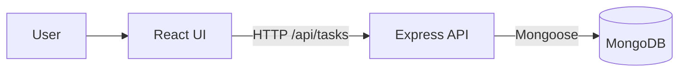
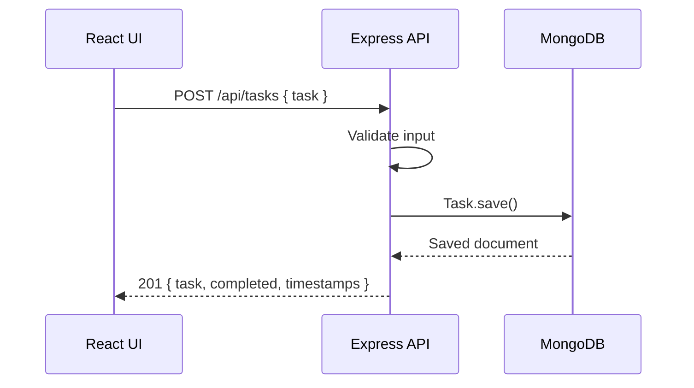

# ARCHITECTURE.md

## Overview

This repository implements a **production-oriented three-tier web application**:

- **Frontend (Presentation tier):** React UI, served in production as static assets via Nginx.
- **Backend (Application tier):** Node.js + Express REST API.
- **Database (Data tier):** MongoDB using Mongoose.

The application provides a simple todo board that supports:
- Create task
- List tasks
- Update task (text and completion status)
- Delete task

---

## Technologies used

- Frontend: React (axios for API calls)
- Backend: Express, helmet, morgan, cors, mongoose
- Tests: node:test + supertest (backend)
- Containerization: Docker + Docker Compose
- Orchestration: Kubernetes manifests under `Kubernetes-Manifests-file/`
- CI/CD: GitHub Actions workflow under `.github/workflows/`

---

## Folder structure

- `Application-Code/backend/`
  - `app.js`: Express middleware + routes + health/readiness endpoints
  - `index.js`: server bootstrap + database connection
  - `routes/tasks.js`: CRUD handlers for `/api/tasks`
  - `models/task.js`: Mongoose schema/model
  - `db.js`: MongoDB connection

- `Application-Code/frontend/`
  - `src/App.js`: UI composition
  - `src/Tasks.js`: UI for listing/adding/updating tasks
  - `src/services/taskServices.js`: axios client + API wrappers

- `Kubernetes-Manifests-file/`
  - Kubernetes YAML manifests (namespace, configmap, secret, deployments, services, ingress, HPA)

---

## Request lifecycle

### 1) Create a task
1. User enters a task in the React UI.
2. `taskServices.addTask()` sends `POST /api/tasks` (axios) to the backend.
3. Express route handler validates `task` input and creates a new Mongoose `Task`.
4. MongoDB persists the record.
5. JSON response returns to React.
6. UI updates the list.

### 2) Health & readiness
- `GET /healthz` returns `{ status: "ok" }`
- `GET /ready` checks MongoDB connection state and returns:
  - `200` when ready
  - `503` when not ready

---

## Data flow (Mermaid)

---

## API flow

---

## Deployment architecture

- **Docker Compose (single host):**
  - Runs MongoDB, backend, and frontend containers on one VM.

- **Kubernetes (cluster):**
  - Deploys backend + frontend + MongoDB and exposes them using Services/Ingress.

---

## Notes / caveats

The repository currently includes **multiple manifest sets** under `Kubernetes-Manifests-file/`.
The Kubernetes guide documents which set to apply.

