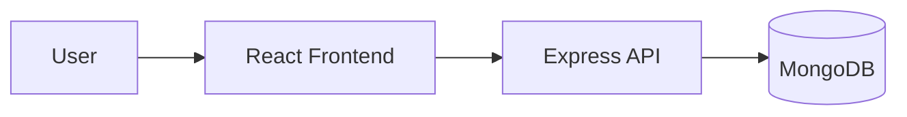
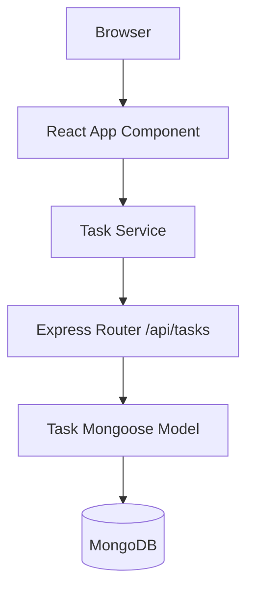

# Architecture

## Overview

The project is a three-tier todo application with a React frontend, an Express API, and a MongoDB database.

## High-Level Diagram

## Low-Level Diagram

## Request Lifecycle

1. User interacts with the frontend.
2. The React UI calls the backend API through Axios.
3. Express validates and processes the request.
4. Mongoose persists or retrieves data from MongoDB.
5. A JSON response is returned to the client.

## Deployment Architecture

- Docker Compose for local orchestration
- Kubernetes manifests for cluster deployment
- Nginx for frontend static hosting
- MongoDB as the data store
